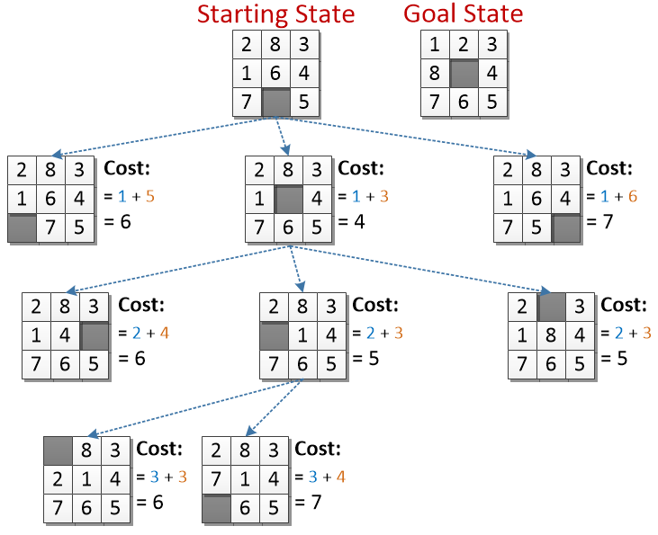
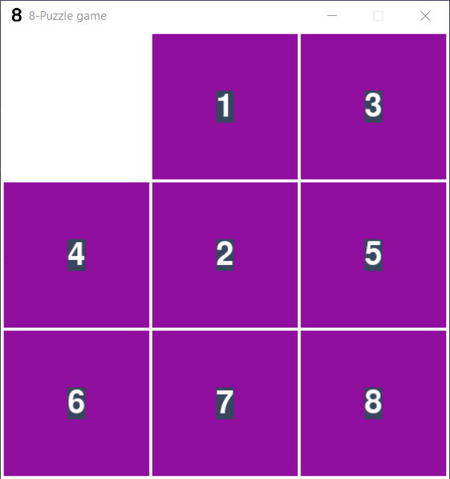

# 8-Puzzle-Game

The 8-puzzle problem is a puzzle invented and popularized by Noyes Palmer Chapman in the 1870s. It is played on a 3-by-3 grid with 8 square blocks labeled 1 through 8 and a blank square. Your goal is to rearrange the blocks so that they are in order.

# How to Solve this game ?

we solved this game using A* algorithm but what is this ?
A\* is a graph traversal and path search algorithm, which is often used in many fields of computer science due to its completeness, optimality, and optimal efficiency. One major practical drawback is its O(b^d) space complexity, as it stores all generated nodes in memory.

# Example of the algorithm

# How to play ?

All you have to do is run the main script to see how the algorithm solving the puzzle on its own.

- the gaol state is:
  [[1, 2, 3], 
[4, 0, 5], 
[6, 7, 8]]
- you can change the game speed from the game settings in game_lib.py, you can also change some settings from the game_interface.py file.
- you can play it by yourself by pressing 't' to switch between your turn and the computer turn.
- you can pause the game by pressing 'p'

# Screenshots of the game

